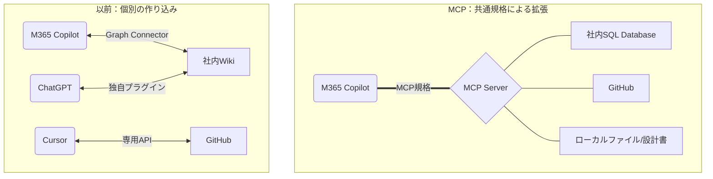
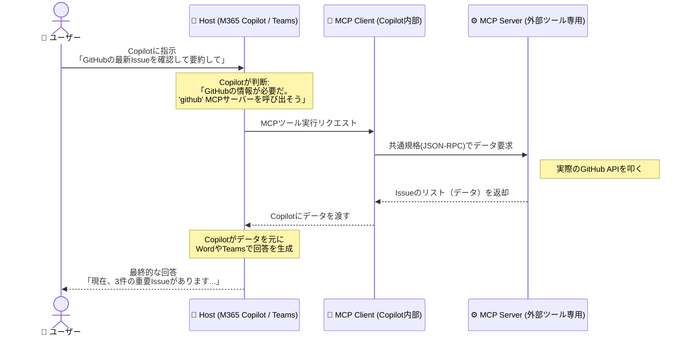
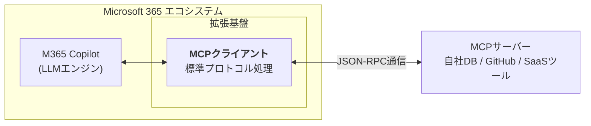
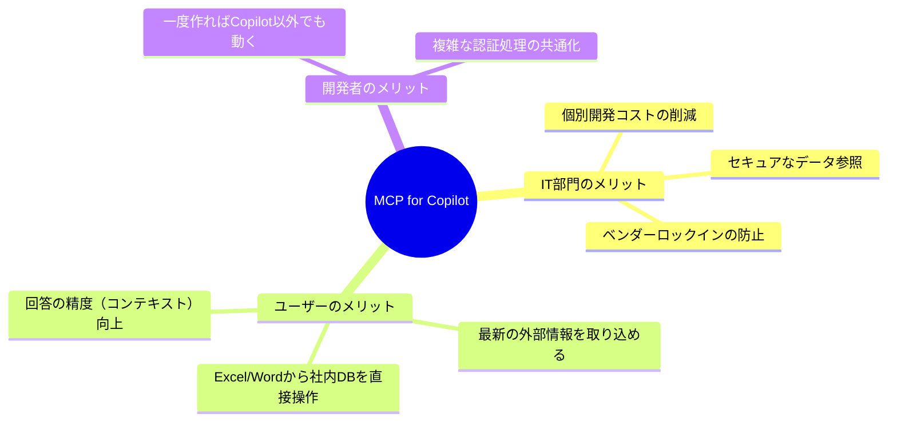

# 🛠️ MCP（Model Context Protocol）初心者ガイド for M365Copilot

MCPは、AIと外部データ・ツールをつなぐ **「AI界の共通USB規格」** です。

---

## 1. 従来の接続 vs MCPによる接続

これまでは、Copilotに外部ツールをつなぐ際は、専用の複雑な設定が必要でした。MCPなら、規格に沿ったサーバーを用意するだけで接続できます。

## 2. 三つの主要コンポーネント

Copilot（**Host**）が「指示を出し」、MCP（**MCP Client**）が「橋渡し」をし、外部ツール（**MCP Server**）が動く3層構造です。

## 3. 構造のイメージ（ビジネスAIのUSB）

M365 CopilotにMCPを導入することで、企業のIT部門とユーザー双方にメリットがあります。

## 4. M365 Copilot × MCP でできること

CopilotがOfficeアプリの枠を超えて、外部の「生データ」を直接扱えるようになります。

|カテゴリ|具体的なアクション（ユースケース）|
|---|---|
|開発連携|Teams上のCopilotからGitHubのプルリク内容を確認・レビュー|
|データ分析|Excelから社内のSQLサーバーへMCP経由でクエリを投げ、グラフ化|
|ドキュメント|ローカルPCにある膨大な過去資料(PDF)を読み込み、Wordで新提案書を作成|
|SaaS連携|SalesforceやZendeskの顧客情報をCopilotが直接参照して回答|
