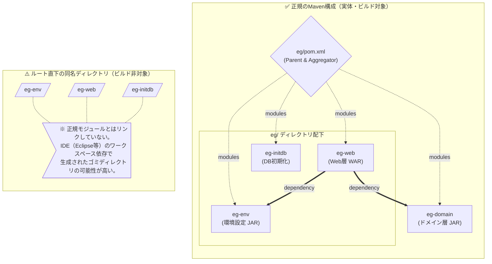

# eg_iams アーキテクチャ確認結果

## 結論

このリポジトリは **Maven マルチモジュール構成（Aggregator/Parent 構成）** です。

- 正規モジュール: `eg/eg-env`, `eg/eg-web`, `eg/eg-initdb`, `eg-domain`
- ルート直下の `eg-env`, `eg-web`, `eg-initdb` は実装本体ではなく、`.project` と `bin` が中心の補助ディレクトリ（IDE 由来の可能性が高い）

## 根拠

### 1. 親 POM のモジュール定義

`eg/pom.xml` で以下の modules が定義されています。

- `eg-env`
- `../eg-domain`
- `eg-web`
- `eg-initdb`

つまり、ビルド基準は `eg` 配下（+ `eg-domain`）です。

### 2. 子モジュールの親参照

例として `eg-domain/pom.xml` は次を親に参照しています。

- `<relativePath>../eg/pom.xml</relativePath>`

これにより、`eg/pom.xml` が親（Parent/Aggregator）であることが確認できます。

### 3. Git 管理対象の件数

追跡ファイル件数の確認結果:

- `top-eg-web = 0`
- `top-eg-env = 0`
- `top-eg-initdb = 0`
- `nested-eg-web = 481`
- `nested-eg-env = 204`
- `nested-eg-initdb = 35`

ルート直下の同名ディレクトリには管理対象ファイルがなく、`eg/` 配下に実体があることを示しています。

## これは何というアーキテクチャか

### ビルド/リポジトリ構成

- **Maven マルチモジュール構成**
- **Parent POM + Aggregator POM**

### アプリケーション構成（責務分割）

- `eg-web`: Web 層（WAR）
- `eg-domain`: ドメイン/業務ロジック層（JAR）
- `eg-env`: 環境設定・外部連携設定（JAR）
- `eg-initdb`: DB 初期化/DDL/初期データ

実体としては、レイヤ分割型のモノリシック構成です。

## 構成図（Mermaid）

## 補足

ルート直下の `eg-env` / `eg-web` / `eg-initdb` は、削除前に IDE 設定依存（Eclipse のワークスペース参照など）を確認してから整理するのが安全です。
