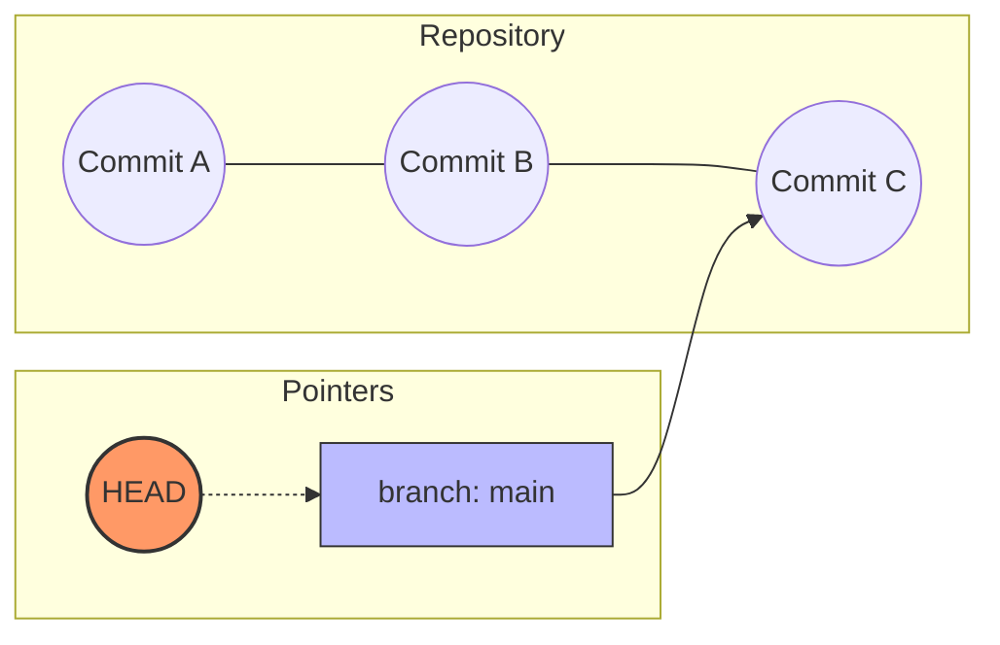
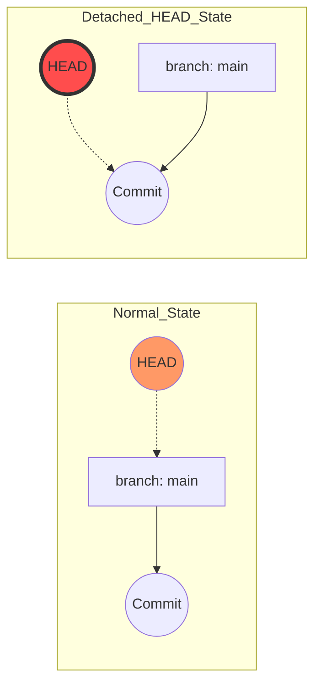
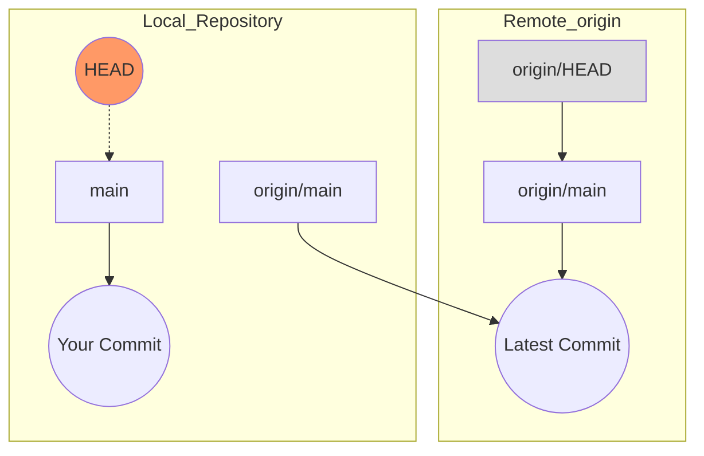

# 「HEAD」まとめ

## 1. HEADの基本概念：現在の立ち位置を示すポインタ
Gitにおける **HEAD（ヘッド）** は、作業ディレクトリで「今、自分がどのコミット（履歴のどの時点）を見ているか」を示す現在地のポインタです。
- **基本的な挙動：** 通常は **「現在チェックアウトしているブランチの最新コミット」** を指し示します。
- **移動の仕組み：** `git checkout` や `git switch` を使ってブランチを切り替えると、HEADも自動的にそのブランチへと移動し、作業ディレクトリの中身がその状態に書き換わります。

## 2. HEADの実体
HEADは魔法のようなプログラムではなく、リポジトリ内の `.git/HEAD` という**単なるテキストファイル**です。
- 通常時の中身は `ref: refs/heads/main` のようになっており、「今はローカルの `main` ブランチを参照している」という情報が記録されています。

## 3. 特殊な状態：Detached HEAD（分離されたHEAD）
ブランチ名ではなく、特定の「コミットハッシュ（例：`a1b2c3d`）」を直接チェックアウトした場合に発生する状態です。
- **仕組み：** `.git/HEAD` の中身が、ブランチへの参照（`ref:...`）ではなく、コミットハッシュそのものに書き換わります。つまり、**HEADがブランチから切り離され、コミットを直接指している状態**です。

- **注意点：** この状態で新たにコミットを行っても、どのブランチにも紐付きません。その後別のブランチに切り替えてしまうと、先ほど作ったコミットは「名前のない迷子状態」になり、後から探し出すのが非常に困難になります（最終的にはGitのガベージコレクションによって削除されます）。

## 4. HEADを利用した相対指定
Gitのコマンドを実行する際、コミットハッシュをフルで入力しなくても、現在のHEADを基準にして「○個前のコミット」と簡単に指定できます。

|記法|意味|用途の例|
|---|---|---|
|`HEAD`|現在のコミット|`git reset --hard HEAD` (現在のコミットの状態に強制リセット)|
|`HEAD`^ または `HEAD~1`|1つ前のコミット|`git reset --soft HEAD^` (直前のコミットをやり直す)|
|`HEAD~n`|n個前のコミット|`git diff HEAD~3` (3つ前のコミットと現在の差分を見る)|

## 5. リモートにおけるHEAD（origin/HEAD）
ローカルだけでなく、リモートリポジトリ（`origin`）側にもHEADの概念が存在します。しかし、役割が少し異なります。

- `origin/main` **（リモート追跡ブランチ）** : リモートにある特定のブランチ（この場合は `main`）が、最新でどのコミットを指しているかをローカルに記録したものです。

- `origin/HEAD`: リモートリポジトリ全体における **「デフォルトブランチ」** を指し示します。「このリポジトリを `git clone` したときに、最初にどのブランチを展開するか」という基準になります。

## 6. origin/HEAD と origin/main が一致しないケース
通常、デフォルトブランチが `main` であれば `origin/HEAD` は `origin/main` を指しますが、以下のようなケースでは一致しません。

#### 1. デフォルトブランチが main 以外に設定されている
リモート（GitHubなど）の設定で、デフォルトが `develop` や `master` になっている場合、`origin/HEAD` はそちらを指します。

#### 2. デフォルトブランチを変更したが、ローカルが古いまま
プロジェクトの途中でリモートのデフォルトを `master` から `main` に変更した場合。手元のローカルPCの `origin/HEAD` は自動では追従しないため、ズレが生じます。

- 解決策: `git remote set-head origin --auto` を実行すると、リモートの最新設定を問い合わせてローカルを正しく更新できます。

#### 3. そもそも origin/HEAD が存在しない
`git clone`ではなく、特殊な手順でリモート設定を追加した場合や、意図的に削除した場合は存在しないことがあります。