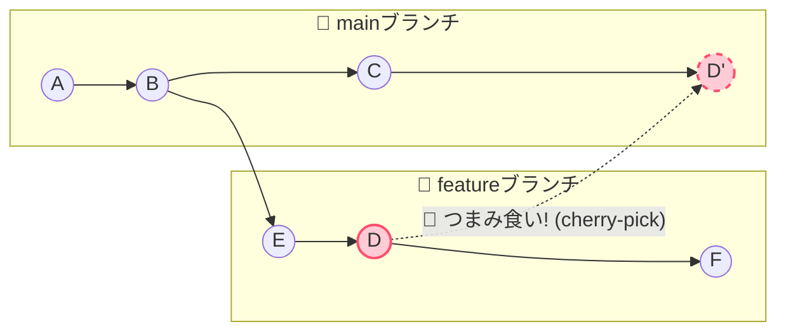

# 🍒 GitのCherry-Pick（チェリーピック）って？

他のブランチから **「このコミットの変更だけ、こっちにもちょうだい！」とピンポイントでコピーしてくる** 、とっても便利な魔法のコマンドです✨

ブランチ全体をガッチャンコ（マージ）するのではなく、「欲しいとこ取り」ができるのが最大の魅力です！

## 🎨 図解でイメージ！

featureブランチにある「D」のコミットだけを、mainブランチにコピー（D'として追加）するイメージ図です👇



🛠️ 使い方は超カンタン！
たったの2ステップで完了します。

```
# 1. まずは「チェリーをもらう側」のブランチに移動します🚶‍♂️
git checkout main

# 2. 欲しいコミットのID（ハッシュ）を狙い撃ち！🔫
git cherry-pick <欲しいコミットのハッシュ>
```

## 💡 プチ情報:

`git cherry-pick <ハッシュA> <ハッシュB>`のように、スペース区切りで複数一気に持ってくることもできちゃいます！

## 🙋‍♀️ どんな時に使うの？（あるあるシチュエーション）

- 🐛 「やばい！リリース済みの本番環境にバグが…！」
👉 開発ブランチで直したバグ修正のコミットだけを、急いで本番ブランチにもコピー（バックポート）したい時！
<br>

- 🚧 「機能は未完成だけど、この設定変更だけ先にもらっていい？」
👉 まだマージできない巨大ブランチの中から、他の人もすぐに使いたい便利なコミットだけを先にメインへ反映させたい時！
<br>

- 😱 「あっ！間違えて別のブランチで作業しちゃった！」
👉 慌てなくてOK！正しいブランチに移動して、間違えたコミットをチェリーピックで引っ張ってくれば救済できます🚑

## ⚠️ ちょこっと注意点

- ID（ハッシュ）が変わっちゃう！
全く同じ変更内容でも、コピー先で作られたコミット（図のD'）は、元のコミット（図のD）とは**別物（新しいハッシュ）**として扱われます。やりすぎると履歴がゴチャゴチャになるので「ここぞ！」という時に使いましょう。

- 💥 コンフリクト（競合）の可能性
今のブランチと持ってきたコミットのコードに矛盾があると、マージの時と同じように「どっちが正しいの!?」とGitがパニック（コンフリクト）を起こすことがあります。