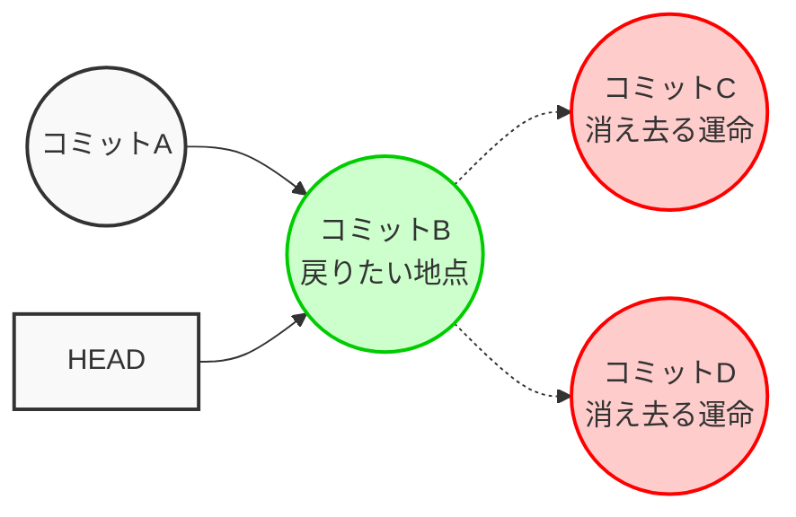
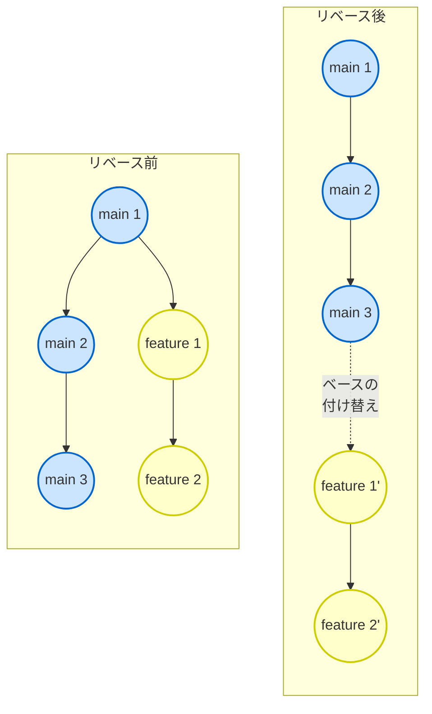
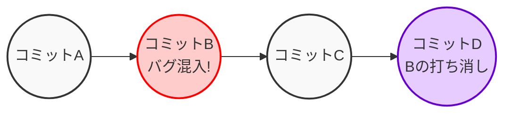
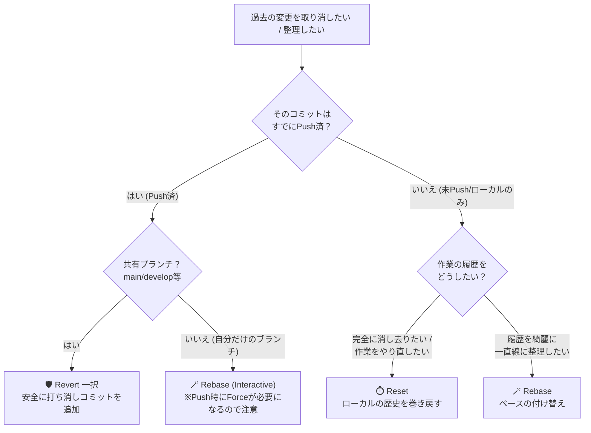

# 🚀 Gitマスターへの道：リセット・リベース・リバート完全指南書

Gitの履歴を操作するこれら3つのコマンドは、目的は似ていますが **「過去をどう扱うか」** という思想が全く異なります。 
それぞれのキャラクターを理解して、VSCode上で自在に操れるようになりましょう！

- **グルーピング**

|カテゴリ|コマンド|特徴|
|---|---|---|
|**歴史修正**|**Reset / Rebase**|過去のコミットを消したり、つなぎ変えたりする。  **「実はこうだった」** と歴史を書き換える。|
|**歴史追記**|**Revert**|過去のミスを打ち消すための「新しいコミット」を作る。  **「ミスしたけど、戻した」** という記録が残る。|

## 1. リセット (`git reset`)：過去へ飛ぶタイムマシン ⏱️

リセットは、現在の状態を過去の特定の時点まで完全に巻き戻す操作です。 
「あ、今のなし！」という時に使う、ローカル環境限定のタイムマシンです。

### 📝 解説と実戦での注意点

- **思想：** 「間違えた歴史は、無かったことにしよう」
- **3つのモードの使い分け：**
  - **1. Soft：** コミットだけ取り消す（ファイル変更とステージ状態は残す）。 
  「コミットメッセージ間違えた！」時に。
  - **2. Mixed (デフォルト)：** コミットとステージを取り消す（ファイル変更は残す）。 
  「変更をいくつかのコミットに細かく分け直したい」時に。
  - **3. Hard：** 全て取り消す（ファイルの変更も消滅）。「今日の作業は全部ゴミ箱へ！」時に。

- ⚠️ **実戦での注意点：**
**絶対にリモートにPush済みのコミットをResetしないこと！** 
 他の人の手元にある歴史と矛盾が生じ、チーム全体を巻き込む大事故（Push拒否や無限コンフリクト）に繋がります。

---

## 2. リベース (`git rebase`)：歴史を紡ぎ直す魔法の杖 🪄

リベースは、ブランチの根元（ベース）を別の場所に付け替える操作です。 
マージコミットを残さず、歴史を美しい一本道（リニア）に保ちたい美しいコードベースを愛する開発者のためのツールです。

📝 **解説と実戦での注意点**

- **思想：** 「まるで最新の`main`から分岐して開発したかのように、歴史を綺麗に書き換えよう」
- **ベストプラクティス：**
自分の作業ブランチ（`feature`）を最新の`main`に追従させる時に使います。 
`git merge main`でも追従できますが、不要なマージコミットが増えて履歴が汚れるため、 
チームによっては「合流前は必ずRebaseすること」というルールが敷かれます。
- ⚠️ **実戦での注意点（Golden Rule of Rebase）:**
Resetと同様、**「すでに公開した（Pushした）ブランチ」をリベースしてはいけません。** 
リベースは「コミットを作り直す」処理なので、ID（ハッシュ値）が変わってしまいます。 
自分一人のローカルブランチでのみ使用しましょう。

---

## 3. リバート (`git revert`)：失敗を糧に進む安全装置 🛡️

リバートは、過去の「特定のコミットで行った変更」を打ち消すための新しいコミットを追加する操作です。 
歴史を消さずに「間違いを正した」という事実を歴史に刻みます。

📝 **解説と実戦での注意点**

- **思想：** 「過去は変えられない。間違いを打ち消す新しい歴史を作って前へ進もう」
- **ベストプラクティス：**
**チームの共有ブランチ（mainやdevelopなど）に混入したバグや不要な変更を取り消す時の唯一の正解**です。 
履歴を書き換えないため、他のメンバーに全く迷惑をかけずに安全に打ち消しをPushできます。

💡 **豆知識：**
複数のファイルが絡むコミットをリバートすると、稀にコンフリクトが起きます。 
その場合はVSCodeのソース管理パネルで差分を確認し、手動で解決してからコミットを完了させます。

---

## 🤝 3つの関係性と「どう選ぶか」の判断フロー

この3つは「いつ、どこで間違えたか」によって明確に使い分けられます。 
以下のフローチャートを頭に入れておくと迷いません。

🏆 **現場でのベストプラクティス（まとめ）**
- **1. 「ローカルは自由、リモートは厳格」:** 自分の手元（未Push）ならResetもRebaseもやり放題です。 
しかし、一度リモートにPushした瞬間に、それらは「共有財産」になります。
- **2. 迷ったら Revert：** 履歴を汚すことよりも、履歴を壊してチーム開発を止めることの方が罪は重いです。 
迷った時や不安な時は、とりあえずRevertを使えば安全です。
- **3. こまめなコミット：** どの操作をするにしても、1つのコミットが巨大すぎると（Reset時の被害も、Revert時のコンフリクトも）地獄を見ます。 
「1コミット＝1つの意味のある小さな変更」を心がけましょう。
