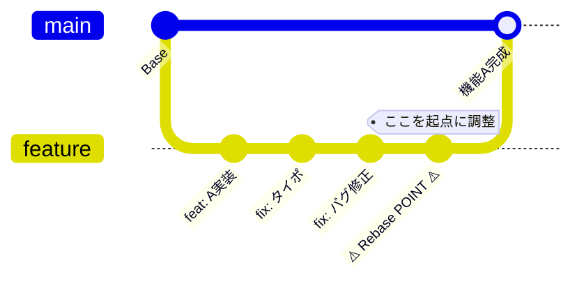
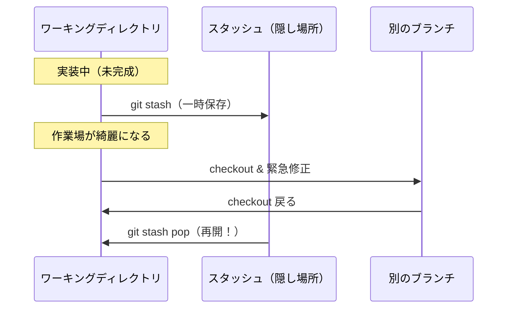

# 🚀 Gitマスターへの道：インタラクティブリベース・スタッシュ完全指南書

## 1. git rebase --interactive (-i)

- **思想：コミットは「作業ログ」ではなく「公開用の物語」**
実戦では、ぐちゃぐちゃになったローカルの履歴を、マージ前に一本の綺麗な線に整えるために使います。

- 🚀 **実戦での使い方**
  - **コミットの集約（Squash）:** 「タイポ修正」や「動作確認」などの細かいコミットを、意味のある大きな単位にまとめます。
  - **並び替え：** 関連する修正が離れた位置にある場合、順番を入れ替えて文脈を分かりやすくします。

- ⚠️ **注意点：歴史の不整合**
一度 `push` してチームで共有しているブランチに対して `rebase -i` を行うと、コミットのハッシュ値が変わってしまいます。他の人がそのブランチをベースに作業していると、「共通の過去」が消滅するため、プッシュ時に強制（`--force`）が必要になり、チームメイトの環境を壊す原因になります。

## 2. git stash

- **思想：コンテキストの「一時退避」と「復元」**
「今やっていることを汚さず、一瞬で別の作業に移る」ためのツールです。

- 🚀 **実戦での使い方**
  - **割り込み対応：** 開発中に「本番環境でバグ！すぐ直して」と言われた際、今のコードをコミットせずに脇に避けます。

  - **Pullの邪魔を排除：** `git pull` しようとしたら「ローカルに変更があるからダメ」と言われた時、一旦 `stash` → `pull` → `pop` で最新コードの上に自分の変更を乗せ直せます。

- ⚠️ **注意点：未追跡ファイルの紛失**
新しく作成したばかりのファイル（git add していないファイル）は、デフォルトでは `stash` の対象になりません。
**「stashしたのに新ファイルが残ってる！」** という混乱を防ぐため、必ず以下のオプションを意識しましょう。
- `git stash -u` (include-untracked): 新規ファイルも含めて退避。
