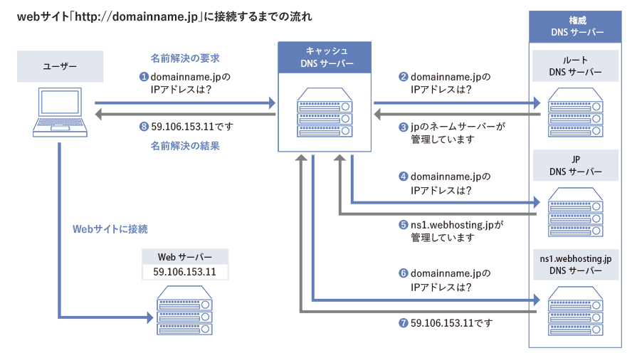
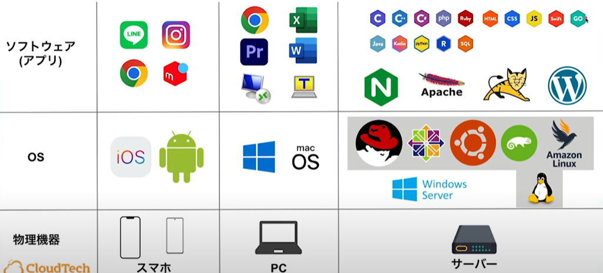
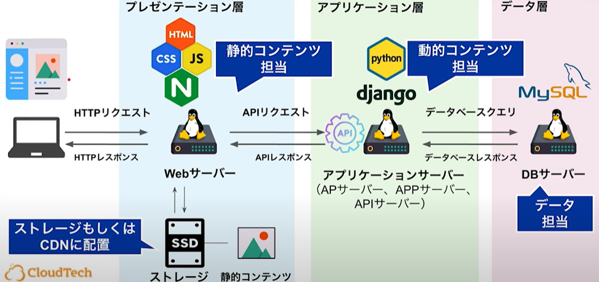

# 勉強会記録：もくもく会in福岡支社

## 1. 概要
- 日付：2025/10/03
- 参考記事/動画：
  - [Qiita：AWS学習ロードマップ](https://qiita.com/KurokawaKouhei/items/7889607418e817fd1cd3)
  - [YouTube：ITインフラエンジニア入門講座 | Webシステムの基礎](https://www.youtube.com/watch?v=6-WKqD1cgj4)
- 内容：インフラの基礎について

## 2. 学んだこと（議論になったところ中心）
- ITインフラとクライアント・サーバーモデルの基礎
- ネットワークの基本：IPアドレス、ドメイン名、DNS
  - DNSサーバの仕組み
    - ドメインで検索した時は、ドメインサーバにて対応するIPアドレスを取得。
    - 取得したIPアドレスでwebサーバに接続

- ドメインの購入と設定方法
- サーバーの設置場所とデータセンターの役割
- サーバーのハードウェアとソフトウェア構成
  - ハードウェアの主要部品
    - CPU
    - メモリ
    - ストレージ
    - NIC

- プログラミング言語とデータベースの役割
  - デーモン：常時起動する常駐プログラム
  - 静的コンテンツと動的コンテンツの違い
    - 表示するHTMLが事前に作成されているか、その場で作成されているか
- APIを用いたサーバーの分離
  - 3層アーキテクチャの構成と役割

  - フロントエンド、バックエンドのアーキテクト別比較表

| 観点    | JSP＋サーブレット (一貫型)      | フロント＋バック分離型            |
| ----- | --------------------- | ---------------------- |
| 技術構成  | Javaで統一 (サーバーでHTML生成) | フロント(JS) + バック(API)    |
| データ通信 | サーバーがHTMLに埋め込み        | JSON / API通信           |
| 分業    | 難しい（Javaスキル必須）        | 分かれやすい（フロント/バック別チーム）   |
| UI/UX | 比較的制限あり（昔ながらのWeb）     | リッチUI (SPA, リアルタイム)    |
| 再利用性  | Web専用                 | APIをモバイルや他サービスでも再利用可能  |
| デプロイ  | 単一アプリ (WAR, JAR)      | フロントとバックを別々にデプロイ       |
| スケール  | 一体型 → スケール単位が大きい      | 独立スケール可 (CDN, API負荷分散) |
| SEO   | 強い（SSRベース）            | SPAは弱い → SSR/SSGで補う    |
- 3層アーキテクチャと冗長化の重要性
  - 冗長化とロードバランサー
    - 