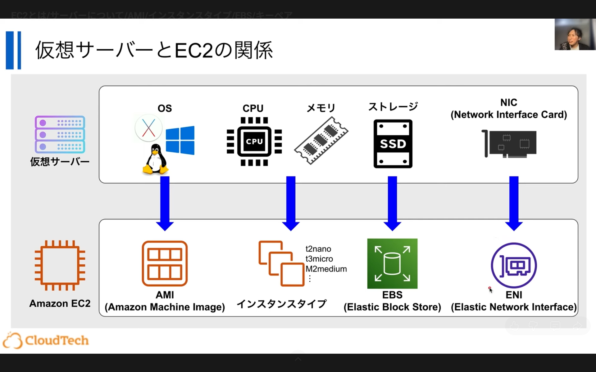
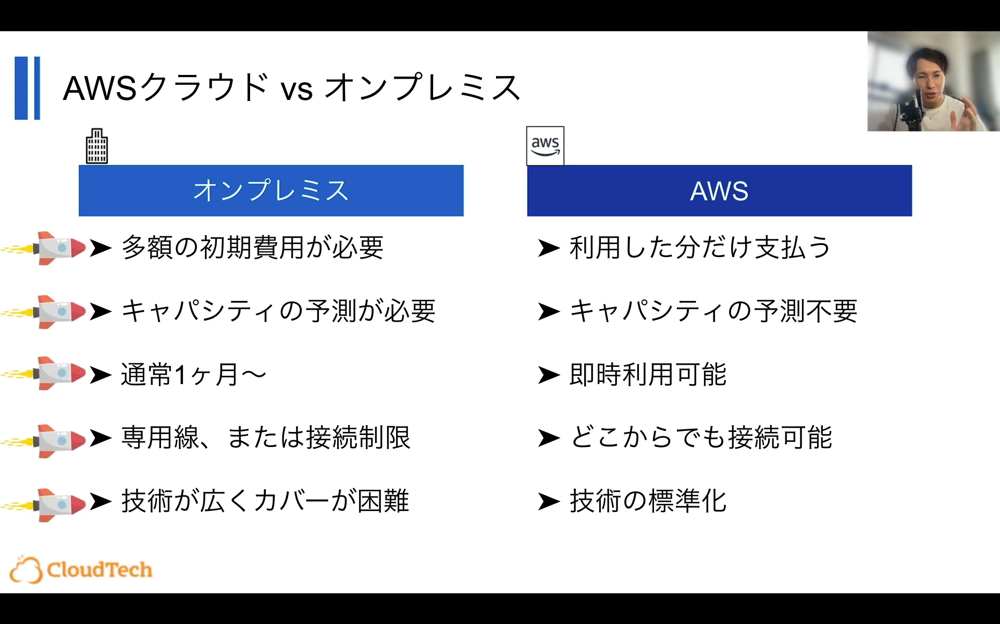
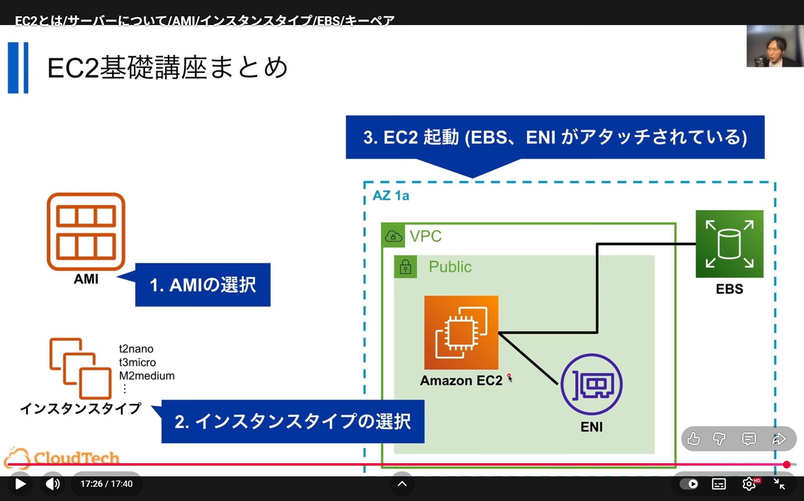
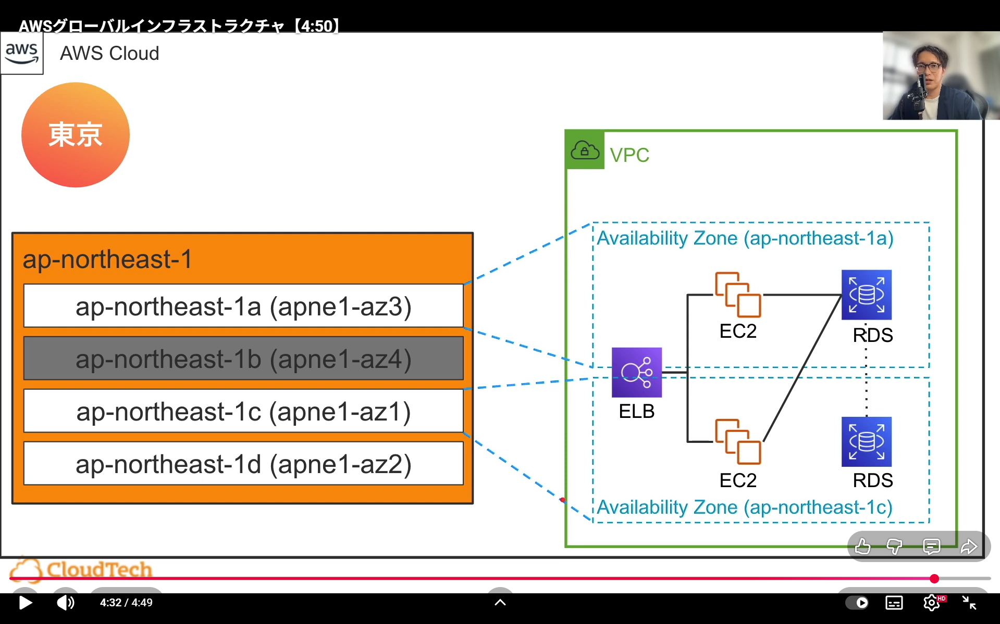
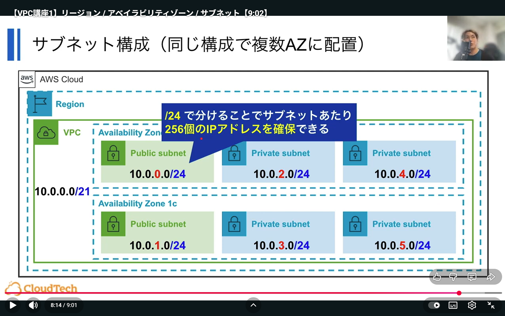

# 勉強会記録：もくもく会in福岡支社

## 1. 概要
- 日付：2025/10/16
- 参考記事/動画：
  - [Qiita：AWS学習ロードマップ](https://qiita.com/KurokawaKouhei/items/7889607418e817fd1cd3)
  - [YouTube：AWSが使われる理由、クラウドサービスのメリット、なぜ今AWSを学ぶべきなのか？](https://www.youtube.com/watch?v=156B6cZ_2aQ)
  - [YouTube：【VPC講座1】リージョン / アベイラビリティゾーン / サブネット](https://www.youtube.com/watch?v=2317shavNoo)
  - [YouTube：EC2とは/サーバーについて/AMI/インスタンスタイプ/EBS/キーペア](https://www.youtube.com/watch?v=36JInU9aNCg)
- 内容：AWSの基礎について

## 2. 学んだこと（議論になったところ中心）
- オンプレとクラウドを比較しながらAWSサービスや理屈を理解

- AWS上の仮想マシンの基礎

- リージョンとAZについて

- VPCの基礎

---
- ISOファイルとAMIの比較

| 項目     | ISOファイル               | AMI                    |
| ------ | --------------------- | ---------------------- |
| 主な用途   | OSのインストールメディア         | EC2インスタンス起動のテンプレート     |
| 内容     | OSのインストールプログラムと構成ファイル | OS本体 + 設定 + アプリケーションなど |
| 実行時の状態 | 起動後にセットアップが必要         | 起動した瞬間にそのまま使える状態       |
| 作成元    | インストールディスクから生成        | 実行中インスタンスのスナップショットから作成 |

- チェックポイント（スナップショット）とAMIの比較

| 項目   | チェックポイント（VMやシミュレーションの例） | AMI                   |
| ---- | ----------------------- | --------------------- |
| 内容   | メモリ・CPU状態・ディスク状態などを保存   | 主にディスク状態（EBSスナップショット） |
| 再開方法 | 同じプロセスをそのまま「再開」         | 新しいインスタンスを「再起動」       |
| 実行状態 | 実行中のRAM・CPU状態も含む        | ディスクの内容のみ（OS再起動が必要）   |

- つまり

| 比較対象     | 類似点                  | 違い                           |
| -------- | -------------------- | ---------------------------- |
| ISOファイル  | OSを配布するためのイメージである点   | AMIはすでにセットアップ済みの実行可能状態       |
| チェックポイント | 実行中の状態を保存するという点で似ている | AMIはRAMやCPU状態は含まず、ディスク状態のみ保持 |

- インスタンスタイプ
  - いっぱいあるから適切なものを選ぼう
- EBS
  - HDDとSSDにそれぞれ2個ずつ、計4個あるから適切なものを選ぼう
- ENI
  - あんまよくわかってない。。。