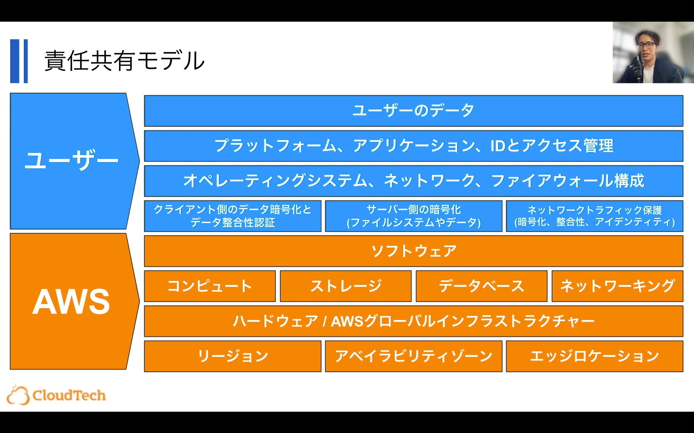
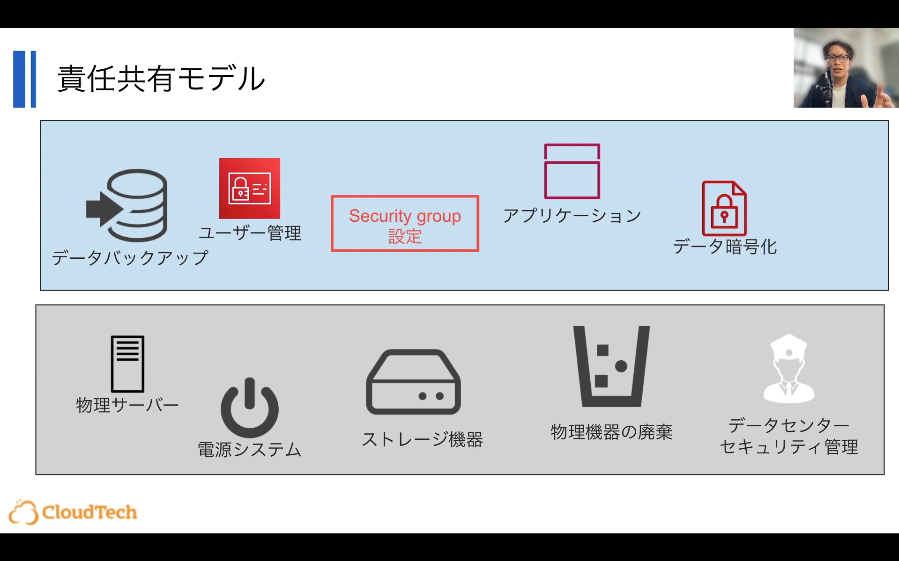
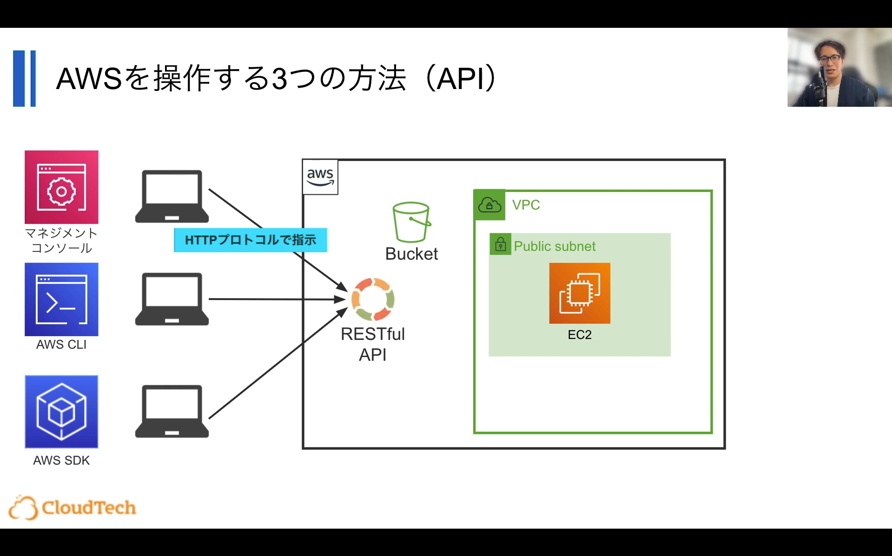
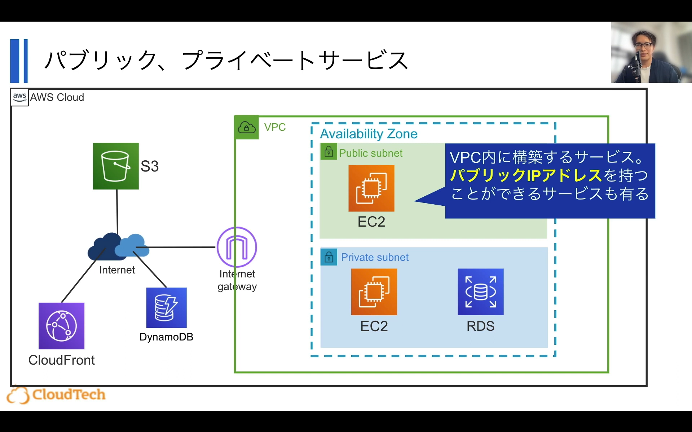
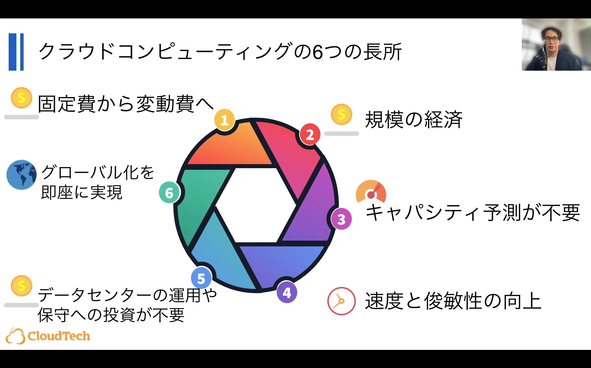

# 勉強会記録：もくもく会in福岡支社

## 1. 概要
- 日付：2025/10/16
- 参考記事/動画：
  - [Qiita：AWS学習ロードマップ](https://qiita.com/KurokawaKouhei/items/7889607418e817fd1cd3)
  - [YouTube：AWS基礎知識](https://www.youtube.com/playlist?list=PL2nCE2iR-lpm7XFAJR0ngD1rkheHgX_0b)
- 内容：AWSの基礎について
  　　　【番外編】DBのレプリケーションについて

## 2. 学んだこと（議論になったところ中心）
- プラクティショナーレベルの最低限必要なAWS知識
- マネージドサービス（AWS責任）とアンマネージドサービス（ユーザー責任）について

---
- AWSの操作方法

---
- パブリックサービスとプライベートサービス

---
- テスト対策

