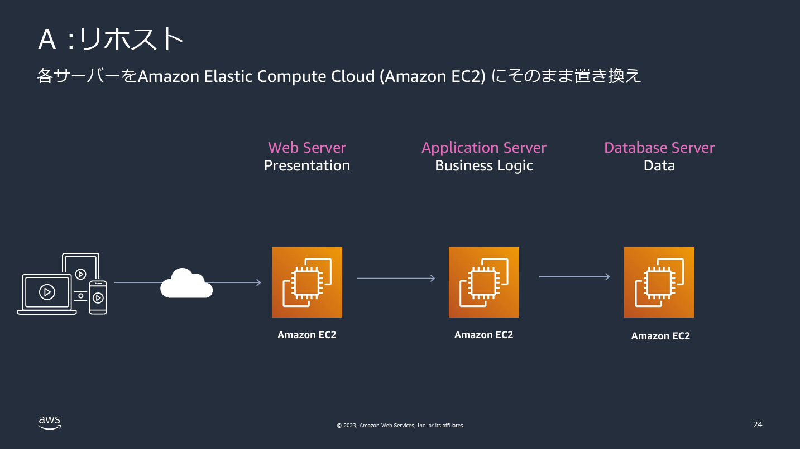
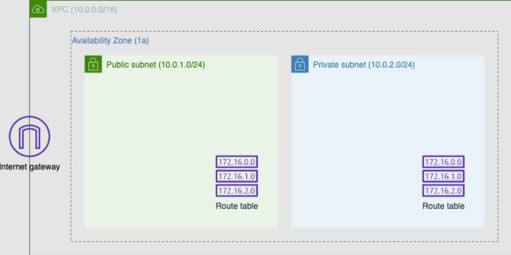

# 勉強会記録：もくもく会in福岡支社

## 1. 概要
- 日付：2025/10/29
- 内容：JavaオンプレシステムのAWS移行
- 参考記事：
  - [Qiita：オンプレからのAWS移行手法と移行戦略](https://qiita.com/tsurunoqiita/items/d191566957da62ead5f8)
  - [Qiita：【AWS】VPC・EC2 作成 ハンズオン](https://qiita.com/zeems/items/1d97d42a99936885ca4a)
  - [Qiita：手軽に学ぶ！初心者向けJavaアプリのAWSデプロイ方法。Eclipse、Tomcat、Apacheで始めるクラウド運用。](https://qiita.com/shuncask/items/779d8e92cc7af63aaa94)

## 2. 学んだこと（議論になったところ中心）
- オンプレシステムのAWS移行方法（7R）
  - 今回はリホスト

- 仮想サーバ（EC2）を構築する前準備
  - VPC
  - igw
  - Public subnet
  - Private subnet
  - Route table

- ルートテーブルについて
  - VPCを作成した時にメインルートテーブルが自動で作成される。
  - 最初に作成したサブネットに割り当てたルートテーブルが、
次に作成したサブネットに自動的に割り当てられる。
  - 今回で言うと最初に作成したサブネット（パブリック）に割り当てたルートテーブルが、
次に作成したサブネット（プライベート）に自動的に割り当てられた。
つまり、意図せずパブリックサブネットになった。
  - igwから外部ネットワーク（0.0.0.0/0）へのルートを追加しないルートテーブルを作成し、
プライベートにしたいサブネットに割り当てることで解決した。
- 補足
  - オンプレのデフォルトゲートウェイ vs AWSのインターネットゲートウェイ

| 項目     | オンプレミスのデフォルトゲートウェイ               | AWSのインターネットゲートウェイ（igw）            |
| ------ | -------------------------------- | --------------------------------- |
| 役割     | 社内LANから外（インターネットや他拠点）へ出る「物理ルーター」 | VPC内のリソースをインターネットに接続する「仮想ルーター」    |
| 配置場所   | 物理ネットワーク機器（ルーターやL3スイッチ）          | AWSのVPCにアタッチされる仮想デバイス             |
| 管理者    | ネットワーク管理者がルーター設定                 | AWSが内部的に提供（ユーザーはVPCに接続するだけ）       |
| 経路設定   | 各端末がルーターのIPをデフォルトゲートウェイとして設定     | ルートテーブルで「0.0.0.0/0 → igw」と設定      |
| 動作範囲   | 同一LAN内のデバイスに対して                  | VPC全体に対して                         |
| NAT機能  | 多くのオンプレルーターがNAT機能を持つ             | igw自体にはNAT機能なし（パブリックIP付きEC2が直接通信） |
| 通信方向   | 双方向（内部から外・外から内）                  | 双方向（ただしセキュリティグループで制御）             |
| 代表的な機器 | Ciscoルーター、YAMAHA RTX、FortiGateなど | AWSリソース（仮想的）                      |

