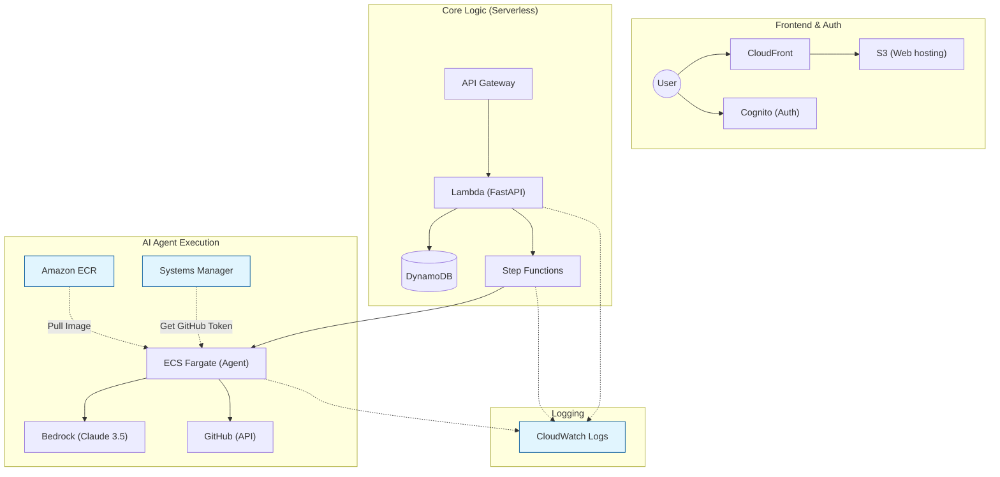

# エージェントシステム設計まとめ

## 1. 目的

GitHub のソースコードと、S3 に配置された設計書（Excel:
画面設計／詳細設計／ドメイン設計／帳票設計）を参照し、
ユーザが入力した要件（項目追加、カラム追加、バリデーション追加、仕様変更など）をもとに、
**ユーザと AI が合意形成した後でのみ** 実装・テスト・GitHub
のプルリクエスト作成までを行うエージェントシステムを構築する。

## 2. 基本方針

-   人間主導（Human-in-the-loop）を徹底
-   自動実行は禁止、必ずユーザの明示的な承認が必要
-   1 プロジェクト単位で共有チャットを利用
-   大規模プロジェクトでも耐えうる監査性・再現性を重視

## 3. 設計書の扱い

-   設計書はアプリからアップロードせず、指定の S3 フォルダに配置
    -   レビュー結果：**アプリからアップロードせずにどこからアップロードする想定？？最初だけ手間かもやけど、ドキュメント系も全部GitHubに置いちゃおう**
-   フォルダ構成例:
    design-docs/`<system>`{=html}/`<release>`{=html}/`<doc_type>`{=html}/\*.xlsx
-   doc_type: screen / detail / domain / report

## 4. アーキテクチャ概要（AWS）

-   フロントエンド: CloudFront + S3
-   API: API Gateway + FastAPI
    -   レビュー結果：**せっかく他はサーバレスのアーキテクチャなのにFastAPI用のインスタンス立てる想定？？API Gateway + Lambda (FastAPI)と思ってる**
-   認証: Amazon Cognito
-   状態管理・チャット・承認管理: DynamoDB
-   ワークフロー制御: AWS Step Functions
-   実行環境: ECS Fargate (Docker)
-   LLM: Amazon Bedrock
-   RAG 検索: OpenSearch Serverless
    -   レビュー結果：**こいつあほ高いらしい笑　別の案考えようか**
-   ストレージ: S3
-   DB 検証: Postgres (RDS/Aurora またはコンテナ)
    -   レビュー結果：**せっかく他はサーバレスのアーキテクチャなのにDB用のインスタンス立てる想定？？実行時だけ使い捨てのDB起動するのがよさそ**

## 5. 共有チャットと合意形成

-   1 プロジェクト = 共有チャット
    -   レビュー結果：**トランザクション処理がだるそうだから、あくまでチャットはユーザーごと。ただし、同プロジェクトメンバーのチャットは、後から誰でも閲覧できる。にしたいかも。**
-   会話・AI提案・参照根拠をすべて保存
-   Decision Card により以下を明確化:
    -   目的
    -   変更内容
    -   影響範囲
    -   受け入れ条件
    -   テスト方針
    -   設計書・コード参照
    -   リスク

## 6. 承認フロー

段階的な承認を必須とする: 1. Plan 承認（設計・影響範囲） 2. Patch
承認（diff 内容） 3. Execute 承認（実行内容・DB 利用）

承認内容はハッシュ化して保存し、すり替えを防止する。

## 7. 実装ワークフロー（Step Functions）

1.  設計書・コード検索（RAG）
2.  Plan 作成
3.  Plan 承認待ち
4.  diff（パッチ）生成
5.  Patch 承認待ち
6.  テスト実行（必要に応じて DB restore）
7.  Execute 承認待ち
8.  push & Backlog PR 作成
9.  結果をチャットへ共有

## 8. DB 利用方針

-   Postgres を使用
-   S3 に配置した pg_dump から restore
-   マスク済みデータを原則使用
-   Execute 承認時に利用 DB / dump / コマンドを明示
    -   レビュー結果：**全部理解できんやったが、DBサーバ立てるんなら同時実行を踏まえて複数個立てないけん、実行した後汚いデータを随時クリーンせないけんから厳しいか。テスト実行中に、DockerコンテナとしてPostgresを立ち上げて、テストが終わったら破棄する。のがアツいらしい。ダンプはもたない、テストデータもAIが作成する。**

## 10. 期待される効果

-   勝手に実装されない安全な運用
-   設計書ベースの根拠ある実装
-   合意形成の可視化と共有
-   週 1 回ペースの勉強会・実務利用の両立

## 11. 構成図（案）

