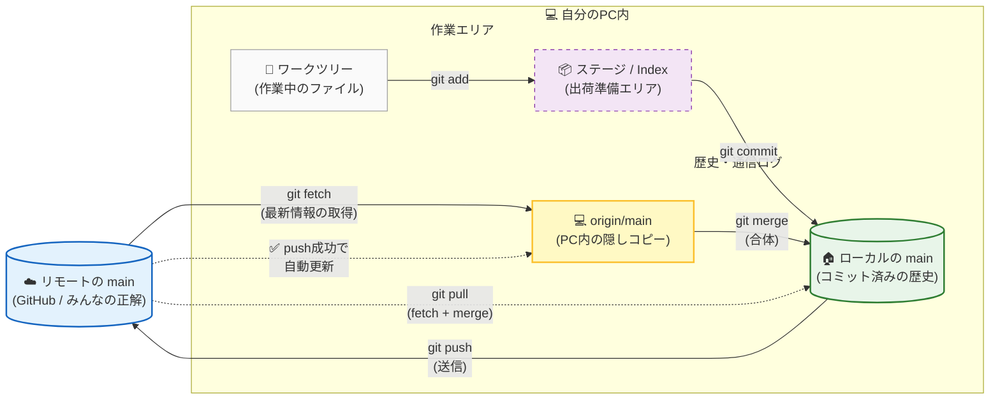

# 🚀 Gitの「3つのmain」振り返りシート

Gitの仕組みは、**3つの場所にある『main』を同期させるゲーム**と考えると非常にシンプルです。

## 1. 各ブランチの役割
| 名称 | 所在 | 性格・役割 |
|---------|---------|-----------|
| **リモートの main**  | サーバー (GitHub等) | 「みんなの正解」。チーム全員が共有する最終的な履歴。|
| **origin/main** | 自分のPC内 (隠し) | 「リモートのコピー」。最後に通信した時のリモートの姿をメモしたもの。 |
| **ローカルの main**  | 自分のPC内 (表舞台) | 「自分の作業場」。今まさにコードを書き換え、コミットする場所。    |

## 2. コマンドによる「3つの場所」の変化
| 操作 | 何が起きるか |
|---|---|
| **git commit** | ローカルのmain だけが進む。（originとのズレが発生） |
| **git push** | ローカルの内容をリモートへ送信。成功すると、リモートとorigin/mainがローカルに追いつく。 |
| **git fetch** | リモートの最新情報を取得。origin/main だけが最新に更新される。（作業場は変わらない） |
| **git merge** | 更新された origin/main を ローカルのmain に合体させる。 |
| **git pull** | fetch ＋ merge を一気に行う。一気にリモートの最新がローカルまで届く。 |

## 3. 要点チェックリスト
- オフラインでも動く理由
    - 自分のPC内に origin/main というコピーを持っているから。
- pullとpushが「対」ではない理由
    - pull は「合体（マージ）」という複雑な工程を含むが、push は単なる「転送」だから。
- コンフリクトの正体
    - origin/main（外の世界）と ローカルmain（自分の世界）で、同じ場所を違う内容で書き換えてしまい、Gitが自動で合体できなくなった状態。
- 情報の鮮度
    - fetch か push をしない限り、手元の origin/main は古い情報のまま固定されている。