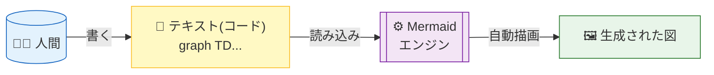
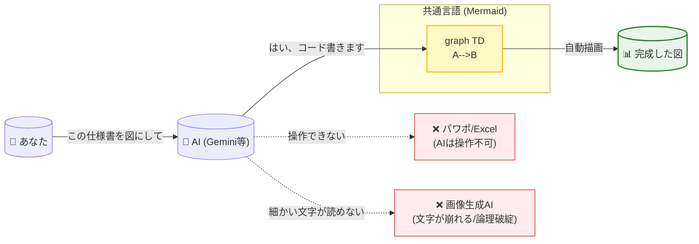
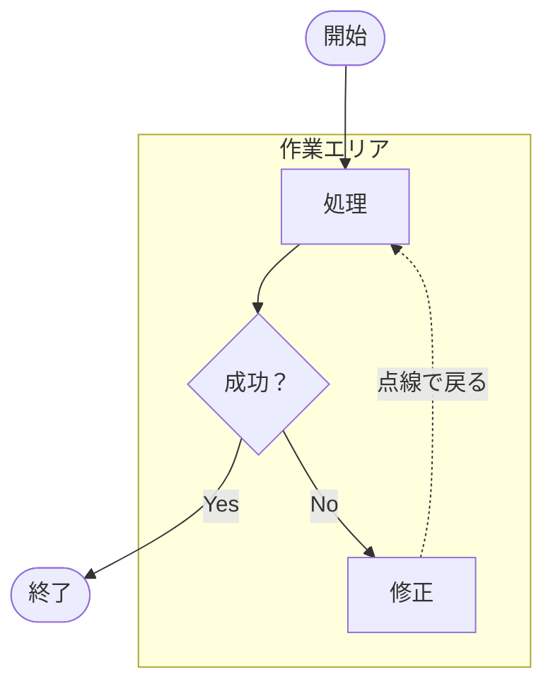
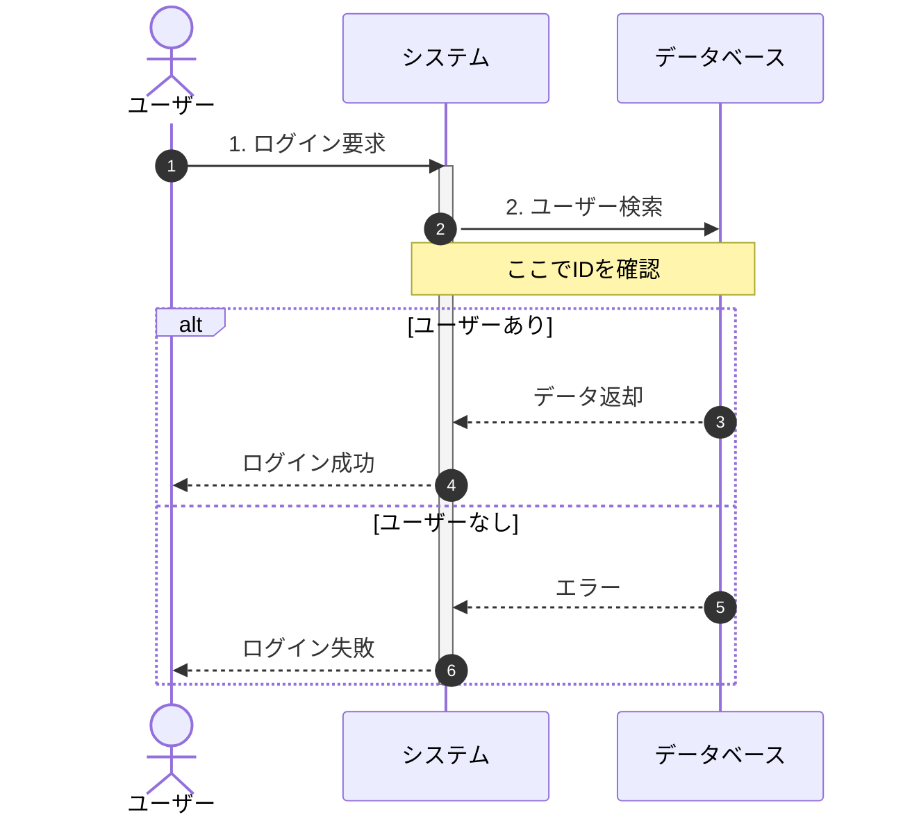
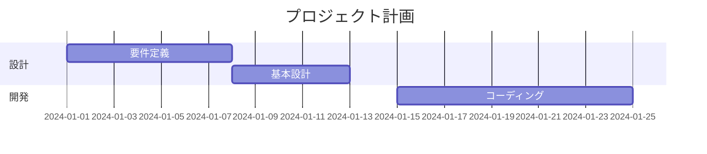
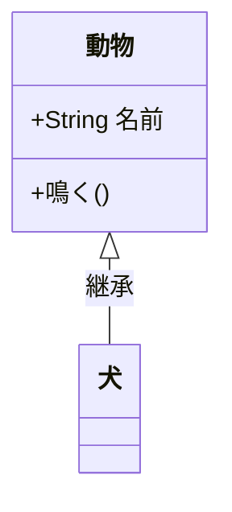

# 🧜‍♀️ Mermaid 入門・振り返りシート

Mermaidは、**「お絵かきツール」ではなく「テキスト（コード）で図を定義する言語」**
仕組みは以下のフローのように、書いたテキストが自動的にレンダリング（描画）されるイメージ

## mermaid記法の一番のメリット
- **とにかくAIフレンドリー**

## 1. 基本：フローチャート (Flowchart)
一番よく使う形式です。「方向」「形」「つなぎ方」の3つさえ覚えればOK

| 役割   | コード例           | 見た目      | 解説                            |
|------|----------------|----------|-------------------------------|
| 方向   | flowchart TD   | (設定)     | Top Down（上から下）。LRなら左から右。      |
| 四角   | A[文字]          | 🔲       | 一般的な処理やステップ。                  |
| 角丸   | A(文字)          | 0        | 開始や終了によく使われる。(([ ])でスタジアム型も可) |
| ひし形  | A{文字}          | ◇        | 条件分岐（IF文）。                    |
| 矢印   | A --> B        | ──▶      | 基本の矢印。線を長くするには --->。          |
| テキスト | A -- Yes --> B | ──Yes──▶ | 矢印の上に文字を乗せる場合。                |
| 点線   | A -.-> B       | - - - ▶  | 関連や「戻る」などの弱い結合。               |

## 2. 応用：シーケンス図 (Sequence Diagram)

| コード                       | 意味                       |
|---------------------------|--------------------------|
| sequenceDiagram           | 冒頭に必須。これを書くとシーケンスモードになる。 |
| A->>B: メッセージ              | 実線矢印。AからBへ依頼を投げる（同期）。    |
| B-->>A: 返答                | 点線矢印。BからAへ返事をする（戻り値）。    |
| alt ... else ... end      | 分岐処理。「もし〜なら、そうでなければ」。    |
| activate A / deactivate A | Aが「活動中（棒が太くなる）」の状態を表す。   |
| Note right of A: メモ       | Aの右側にメモ書き（付箋）を貼る。        |

## 3. その他の便利な図表
Mermaidはフローチャート以外もOK。

### ガントチャート (Gantt)

### クラス図 (Class Diagram)

## 4. 要点チェックリスト（トラブルシューティング）
- 日本語が文字化けする？
    - 基本的には大丈夫ですが、記号（[]や()）の中に日本語を入れるときは、"（ダブルクォート）で囲むと安全です。
    - 例: A["日本語のラベル"]

- 形が変わらない？
    - [ ( { などの括弧の種類で形が決まります。閉じ括弧の種類を間違えていないかチェック！

- 表示されない？
    - 先頭の宣言（flowchart TD や sequenceDiagram）が正しいか確認してください。スペルミスに注意。

- どこで書ける？
    - GitHub (README.mdなど)
    - Notion (コードブロックでMermaidを選択)
    - VS Code (拡張機能: Markdown Preview Mermaid Support)