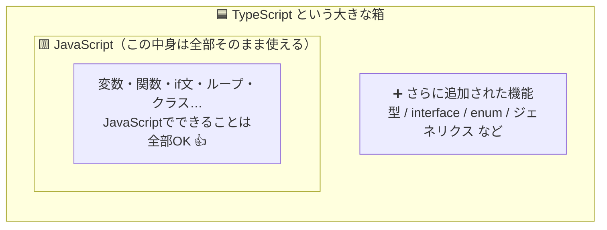
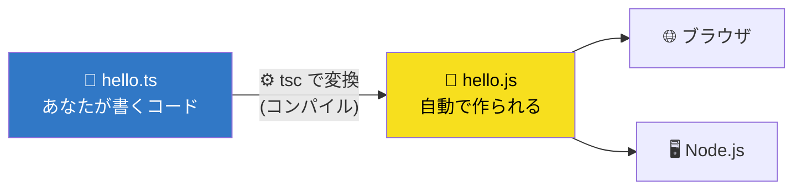
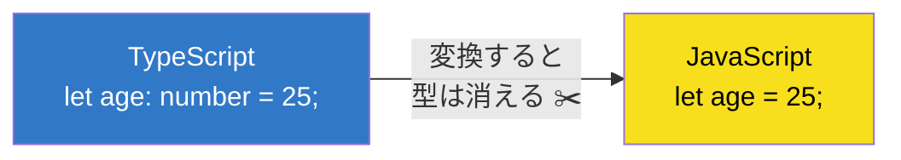
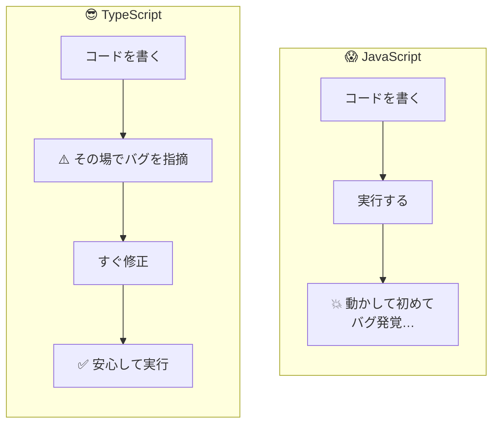
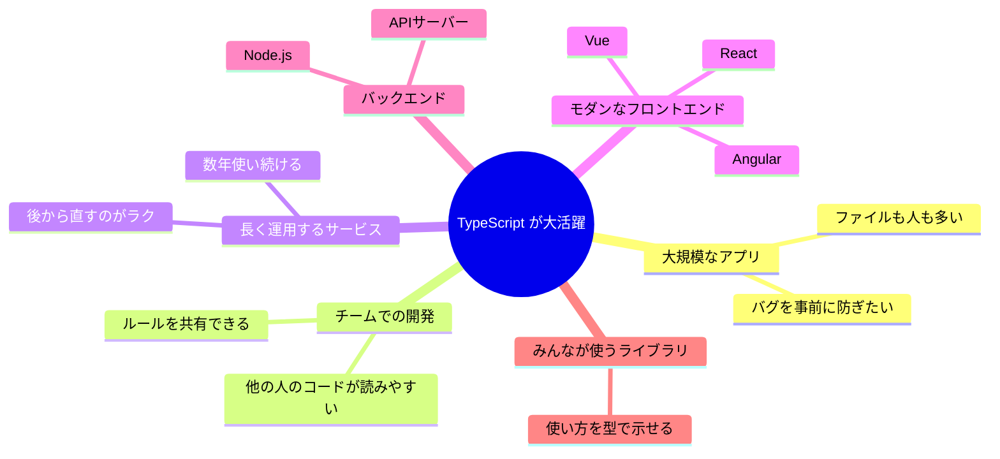
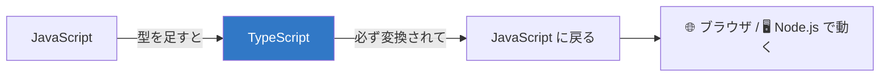

# 🚀 はじめてのTypeScript入門

> 「JavaScriptは少し知ってる（or 名前は聞いたことある）けど、TypeScriptって何？」
> そんな人向けの、図たっぷり・やさしいまとめです 🌱

---

## 📘 もくじ
1. TypeScriptとは？（JavaScriptとの関係）
2. 必ずJavaScriptに変換されるの？
3. TypeScriptを使うべき理由
4. こんなシステムに特に向いてる
5. まとめ

---

## 1. 🤔 TypeScriptとは？（JavaScriptとの関係）

ひとことで言うと…

> ### **TypeScript ＝ JavaScript ＋「型（かた）」**

Microsoftが作った言語で、JavaScriptに「型」という仕組みを足したものです。

### 📦 いちばん大事なポイント

**「JavaScriptのコードは、そのままTypeScriptとしても動く」**

つまりTypeScriptは、JavaScriptを **すっぽり包み込む大きな箱** のようなもの。
（こういう関係を「スーパーセット＝上位互換」と呼びます）



### 💡 そもそも「型」ってなに？

「この箱には“数字”しか入れちゃダメ」という **ラベル** のようなものです 🏷️

ラベルを貼っておくと、間違って文字を入れようとしたときに **すぐ気づけます**。

---

## 2. 🔄 必ずJavaScriptに変換されるの？

> ### **→ はい！最終的にはほぼ必ずJavaScriptに変換されます。**

ブラウザやNode.jsは、実は **TypeScriptを直接は読めません**。
JavaScriptしか理解できないので、変換（＝コンパイル）が必要なんです。



### ✂️ 変換すると「型」は消える

型はあくまで「書いてる人を助けるためのメモ」📝
なので、変換後のJavaScriptからは型の情報はキレイに消えてなくなります。



> 💬 **補足**：変換の基本ツールは `tsc` ですが、実際の開発では Vite・esbuild・swc・Babel など高速なツールもよく使われます。
> また Deno や Bun のように「`.ts`をそのまま実行できる」環境もありますが、**内部では結局JavaScript相当に変換（型を削除）してから動かしています**。
> なので「TypeScript＝最後はJavaScriptになる」という考え方でOKです 🙆

---

## 3. ✨ TypeScriptを使うべき理由

### ① バグを「書いてる最中」に見つけられる 🐛

これが最大のメリット！
JavaScriptだと、**実行するまで間違いに気づけない** ことがあります。

**😱 JavaScriptの場合：**
```js
function add(a, b) {
  return a + b;
}

add(5, "10");  // 結果は "510" … 文字列としてくっついちゃう！
               // しかもエラーが出ないので気づけない 😱
```

**😎 TypeScriptの場合：**
```ts
function add(a: number, b: number) {
  return a + b;
}

add(5, "10");  // ⚠️ エラー！「"10"は数字じゃないよ」と
               // 実行する前（書いてる時）に教えてくれる ✅
```

「いつバグに気づけるか」を図にするとこんな差👇



### ② エディタの補完がすごく賢くなる 🧠

入力中に「次に使えるもの」を自動で提案してくれます。
打ち間違いも激減し、ドキュメントを見にいく回数も減ります。

### ③ コードが「説明書」になる 📖

型を見れば「この関数は **何を受け取って・何を返すのか**」が一目でわかります。
未来の自分やチームメンバーへの、親切なメモになります。

### ④ 大きくなっても壊れにくい 🏗️

コードが増えても、変更したときに **影響が出る場所をTypeScriptが教えてくれる** ので、
安心して直したり機能追加したりできます。

---

## 4. 🎯 こんなシステムに特に向いてる

TypeScriptは基本「なんでも」書けますが、特に効果バツグンなのはこんな場面👇



### 🤏 逆に「なくてもいいかも」な場面
- 数行で終わる **使い捨てスクリプト**
- とにかく今すぐ動かしたい **超小さな実験**

> ただし最近は、小さなプロジェクトでも「最初からTypeScript」が主流になりつつあります 📈

---

## 5. 📝 まとめ



| ポイント | ひとことで言うと |
|---|---|
| 🤔 TypeScriptとは | JavaScript ＋ 型。JSをそのまま含む上位互換 |
| 🔄 変換について | 最後はJavaScriptに変換される（型は消える） |
| ✨ 使う理由 | バグを早く発見・補完が賢い・コードが読みやすい |
| 🎯 向いてるもの | 大規模／チーム／長期運用のシステム |

---

### 🚗💨 さいごに、ひとことで

> **TypeScriptは「JavaScriptに安全ベルトを付けたもの」。**
> 書くときは少し手間でも、後からとっても助けてくれる言語です。
